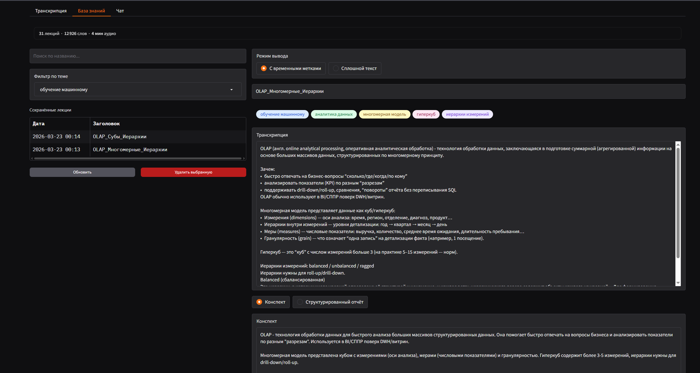
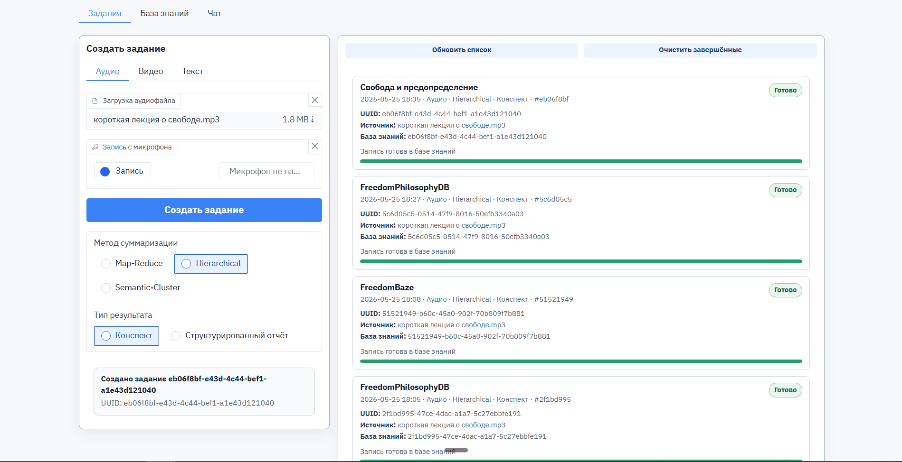

# CHANGELOG

Журнал содержит описание основных изменений, выполненных в рамках разработки локального прототипа системы интеллектуальной обработки аудиолекций.

Изменения направлены на развитие архитектуры приложения, стабилизацию пайплайна обработки материалов, улучшение пользовательского интерфейса, организацию очереди заданий, повышение наблюдаемости работы системы и подготовку прототипа к дальнейшему исследованию методов суммаризации длинных лекционных транскриптов.

### Переработан пользовательский интерфейс под основные сценарии работы

Пользовательский интерфейс был переработан с учётом того, как реально работает пользователь:
сначала создаётся задача, затем отслеживается её статус, после этого просматривается результат и уже потом открывается база знаний.
Ранний вариант выглядел как набор отдельных технических блоков и не показывал эту последовательность достаточно явно.

Сравнение визуальных изменений:

| До | После |
| --- | --- |
|  |  |

В рамках доработки были улучшены:
- структура раздела заданий;
- отображение списка обработок;
- визуальное разделение областей интерфейса;
- панель поиска и выбора записей базы знаний;
- карточка выбранной записи;
- отображение тем и тегов;
- пустые состояния;
- читаемость элементов управления;
- светлая тема приложения.

Теперь интерфейс лучше совпадает с логикой работы системы: пользователь сначала создаёт задание, затем следит за выполнением, после чего переходит к просмотру результата и работе с базой знаний.

## Added

### Добавлена система диагностического журналирования

В проект добавлена система журналирования, необходимая для разработки, отладки и последующего сопровождения прототипа.

До выполнения этой задачи при запуске приложения было сложно определить, на каком этапе возникает ошибка или задержка: при импорте зависимостей, запуске пользовательского интерфейса, старте ASR/LLM-воркеров, обращении к Ollama или обработке очереди. Это затрудняло поиск причин зависаний и нестабильного поведения системы.

В рамках доработки добавлены:
- общий механизм логирования событий;
- вывод диагностических сообщений в консоль;
- запись событий обработки в журнал активности;
- сообщения о старте основных компонентов приложения;
- диагностические сведения о состоянии CPU, RAM, GPU и VRAM;
- логирование этапов работы ASR, LLM и RAG-компонентов.

В результате работа прототипа стала более наблюдаемой. Теперь при запуске и обработке материалов можно понять, какой компонент выполняется, где возникла задержка и какие ресурсы используются системой.

### Добавлен механизм заданий обработки

В приложение добавлен механизм заданий, который позволяет работать не только с одним последним запуском, а с набором обработок.

Ранее пользователь фактически видел только состояние последней операции. Такой подход был неудобен для системы обработки лекционных материалов, потому что пользователь может загружать несколько аудио-, видео- или текстовых файлов и должен понимать, какие задания находятся в очереди, какие уже завершены, а какие требуют внимания.

Для решения этой проблемы реализован реестр заданий на SQLite. При создании новой обработки в системе создаётся запись о задании, а его состояние определяется по артефактам пайплайна: наличию файла в очереди, промежуточных файлов обработки, транскрипта, конспекта и записи в базе знаний.

В пользовательском интерфейсе добавлен раздел для работы с заданиями. В нём можно:
- создать новое задание на обработку;
- увидеть список заданий;
- отследить текущий статус обработки;
- обновить состояние;
- удалить отдельную запись;
- очистить завершённые или ошибочные задания.
  
 

Эта доработка сделала процесс обработки материалов более понятным и управляемым.

### Добавлена диагностика входных медиафайлов

Для повышения надёжности обработки аудиоматериалов добавлена диагностика входных файлов.

При постановке файла в очередь система фиксирует сведения о размере и длительности медиа. Это позволяет быстрее обнаруживать проблемы, связанные с некорректной загрузкой, обрезкой файла или ошибками на этапе передачи данных из интерфейса в backend.

Такая диагностика особенно важна для длинных лекционных записей, потому что при их обработке необходимо контролировать, что в пайплайн действительно попал полный исходный файл, а не его укороченная версия.

## Changed

### Выполнено модульное разделение архитектуры приложения

Была переработана структура gateway-приложения. Ранее значительная часть логики была сосредоточена в одном крупном файле: запуск приложения, настройка окружения, старт фоновых процессов, сборка интерфейса, подключение обработчиков событий, стили и часть сервисной логики.

Такая структура затрудняла развитие проекта. Любое изменение интерфейса могло затронуть запуск приложения или обработку данных, а поиск нужной логики занимал больше времени.

В результате доработки логика приложения была разделена на несколько направлений:
- runtime-часть для запуска, диагностики и управления процессами;
- отдельные модули пользовательского интерфейса;
- модули вкладок интерфейса;
- обработчики пользовательских событий;
- сервисные функции для базы знаний и RAG;
- отдельные файлы для темы и визуального оформления.

После разделения `gateway/app.py` стал выполнять роль точки входа, а основная логика была вынесена в специализированные модули. Это упростило сопровождение проекта, снизило связность компонентов и подготовило архитектуру к дальнейшему расширению.

### Проработан подход к запуску локального прототипа

Был проанализирован подход к запуску системы на локальной машине.

Проект использует несколько внешних и тяжёлых компонентов: ASR-модель, LLM через Ollama, Gradio-интерфейс, дополнительные Python-зависимости, ffmpeg и файловое хранилище промежуточных результатов. Из-за этого запуск системы нельзя рассматривать как запуск одного простого скрипта.

В ходе работы были рассмотрены разные варианты упаковки и развёртывания:
- сборка в единый исполняемый файл;
- запуск через Docker / Docker Compose;
- запуск через набор скриптов установки, диагностики и старта приложения.

Для текущего состояния прототипа более реалистичным вариантом выбран scripted deployment: набор понятных сценариев запуска и проверки окружения. Такой подход позволяет не скрывать сложность проекта, а управлять ею через отдельные режимы и инструкции.

Дополнительно был проработан вариант разделения запуска на несколько режимов:
- облегчённый режим для работы с текстовым ядром;
- полный режим с ASR-обработкой;
- исследовательский режим для экспериментов с методами суммаризации.

### Переработан механизм очереди обработки

Очередь обработки была доработана вместе с механизмом заданий.

Изначально обработка файлов была менее устойчивой: при повторных запусках или одновременной работе нескольких процессов мог возникать риск двойного захвата одного и того же файла. Это могло приводить к ошибкам, некорректному состоянию очереди или повторной обработке одного материала.

В рамках доработки были добавлены механизмы стабилизации очереди:
- промежуточное состояние для файлов, уже взятых в обработку;
- атомарный захват заданий;
- lock-файлы для защиты от повторной LLM-обработки;
- диагностические сообщения о захвате заданий;
- защита от запуска нескольких одинаковых фоновых процессов.

Также была добавлена логика корректного завершения фоновых ASR/LLM-процессов при закрытии приложения. Это снижает риск ситуации, когда старые воркеры остаются работать после закрытия интерфейса и конфликтуют со следующим запуском системы.

В результате очередь обработки стала более предсказуемой и устойчивой.

### Доработана логика формирования записей базы знаний

Была доработана логика формирования записей базы знаний, в том числе генерация названий для обработанных материалов.

Ранее названия могли формироваться неудачно: система могла использовать случайные фрагменты начала транскрипта, технические строки, латинские идентификаторы или слишком общие формулировки. Из-за этого база знаний становилась менее удобной для поиска и просмотра.

Логика генерации названий была переработана:
- название теперь формируется на основе конспекта и выделенных тем;
- результат генерации дополнительно очищается;
- неподходящие варианты фильтруются;
- предусмотрен резервный вариант названия на основе тем;
- снижена зависимость от первых фраз транскрипта.

Это улучшило читаемость базы знаний и сделало результаты обработки более понятными для пользователя.

### Проанализировано потребление RAM, VRAM и GPU

Был проведён анализ потребления ресурсов основными компонентами системы.

Эта задача важна для проекта, поскольку прототип должен работать локально и учитывать ограничения пользовательского оборудования. Наибольшие риски связаны с одновременной работой ASR-модели, LLM, embedding-модели и RAG-компонента.

В ходе анализа были проверены:

* потребление памяти при запуске интерфейса;
* влияние тяжёлых ML-библиотек;
* работа ASR/LLM-воркеров;
* загрузка LLM через Ollama;
* использование embedding-модели;
* риск одновременного обращения нескольких компонентов к GPU.

По результатам анализа была изменена логика использования ресурсов:

* embedding-модель переведена на CPU;
* для RAG-компонента добавлено отдельное состояние использования GPU;
* LLM освобождает ресурсы после завершения ответа;
* снижена вероятность конфликтов между ASR, LLM и RAG.

Эти изменения повышают устойчивость прототипа при работе в условиях ограниченных вычислительных ресурсов.

## Fixed

### Исправлена обработка длинных аудиофайлов

В ходе тестирования была выявлена проблема с обработкой длинных аудиозаписей. В отдельных случаях система распознавала только начальную часть файла или теряла часть длинных фрагментов при ASR-обработке.

Проблема была связана с двумя факторами:

* особенностями передачи аудио через компонент интерфейса;
* некорректной обработкой слишком длинных ASR-фрагментов.

Для исправления были разделены сценарии загрузки готового файла и записи с микрофона. Готовые аудиофайлы теперь передаются в очередь как исходные файлы, без лишней промежуточной обработки со стороны аудиокомпонента интерфейса.

Также была доработана логика обработки длинных grouped chunks: такие фрагменты дополнительно разбиваются на более короткие части, что повышает устойчивость распознавания и снижает риск потери участков лекции.

В результате длинные аудиозаписи стали обрабатываться полнее и предсказуемее.

### Исправлены проблемы повторной обработки заданий

Была исправлена проблема, при которой один и тот же материал мог быть подхвачен несколькими фоновыми процессами.

Для устранения этой ситуации добавлены механизмы блокировки и атомарного захвата заданий. Теперь файл сначала переводится в промежуточное состояние обработки, а LLM-этап защищается lock-файлом. Это предотвращает повторную обработку одного и того же транскрипта и снижает риск повреждения промежуточных результатов.

### Исправлено отображение карточки записи базы знаний

Была исправлена проблема первого отображения выбранной записи в базе знаний. Ранее при первом выборе могли отображаться не все элементы карточки, а часть данных появлялась только после повторного перехода между вкладками.

После доработки карточка записи отображается корректно уже при первом выборе. Основной конспект, служебные поля, темы и файл результата показываются сразу, а полный транскрипт вынесен в сворачиваемый блок, чтобы не перегружать интерфейс.

### Исправлено поведение фоновых процессов при закрытии приложения

Была исправлена проблема, при которой после закрытия gateway-приложения ASR/LLM-воркеры могли оставаться запущенными.

Это могло приводить к конфликтам при повторном старте приложения, особенно если старые процессы продолжали использовать прежний код или удерживать ресурсы. Для решения добавлен механизм штатного завершения фоновых процессов и сброса состояния GPU при закрытии приложения.

## Итог

В результате выполненных изменений локальный прототип системы интеллектуальной обработки аудиолекций стал более устойчивым, понятным и пригодным для дальнейшей разработки.

Основные результаты:

* архитектура приложения стала более модульной;
* запуск и обработка стали лучше диагностироваться;
* появился механизм заданий и очередь обработки;
* улучшена устойчивость ASR/LLM-пайплайна;
* исправлена обработка длинных аудиозаписей;
* доработана база знаний;
* интерфейс стал ближе к реальным пользовательским сценариям;
* снижены риски конфликтов за RAM, VRAM и GPU.

Выполненные задачи подготовили прототип к дальнейшему тестированию, демонстрации и исследованию методов суммаризации длинных лекционных транскриптов.
