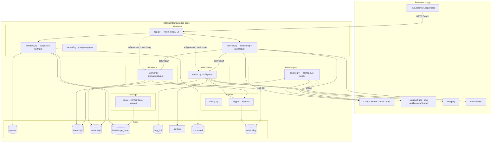

# Intelligent Knowledge Base

> Прототип интеллектуальной базы знаний с автоматической транскрипцией аудио/видео, суммаризацией и RAG-поиском.
> Разработан как исследовательский проект для оценки методов суммаризации длинных русскоязычных лекций в условиях ограниченных аппаратных ресурсов (4 GB VRAM).


---

## Возможности

| Компонент | Описание |
|-----------|----------|
| **Транскрипция** | Автоматическое распознавание речи из аудио и видео — GigaAM (SberDevices) |
| **Суммаризация** | Три метода суммаризации на выбор: Map-Reduce, Sequential, Hierarchical |
| **База знаний** | Хранение, поиск, фильтрация и экспорт транскрипций с конспектами |
| **RAG-чат** | Вопросы по базе знаний с векторным поиском и указанием источников |
| **Мониторинг** | Watchdog-перезапуск воркеров, журнал активности, статус GPU/VRAM |
| **Бенчмарк** | Оценка ASR (WER/CER), суммаризации и RAG; сравнение методов суммаризации |

---

## Архитектура



Воркеры запускаются как подпроцессы (`subprocess.Popen`). IPC — через файловую систему (`data/`). Gateway отслеживает состояние воркеров и перезапускает их при падении.

---

## Методы суммаризации

Центральная исследовательская задача — сравнение трёх методов суммаризации длинных транскрипций при ограниченном контекстном окне LLM (2048 токенов, 4 GB VRAM):

| Метод | Академическое название | LLM-вызовов (18 чанков) | Контекст на вызов |
|-------|------------------------|-------------------------|-------------------|
| **Map-Reduce** | Параллельная суммаризация + плоское слияние | 19 | растёт с N |
| **Sequential** | Последовательная суммаризация с накоплением | 18 | фиксированный |
| **Hierarchical** | Иерархическая суммаризация Map-Reduce | ~27 | фиксированный |

```
Map-Reduce:   [s1 … s18] ───── один merge-вызов ───── итог   (переполнение при N > 8)

Sequential:   s1→r1, r1+s2→r2, …, r17+s18→итог              O(N) вызовов, O(1) контекст

Hierarchical: [s1,s2,s3]→A  [s4,s5,s6]→B  [s7,s8,s9]→C
              [A,B,C]→D  …
              D→итог                                          ceil(log3 N) уровней
```

Метод выбирается в UI. Сравнение метрик: `python benchmark/compare_methods.py`.

---

## Структура проекта

```
prototype/
├── gateway/
│   ├── app.py              # точка входа, сборка UI
│   ├── handlers.py         # загрузка файлов, поллинг результатов
│   ├── formatting.py       # рендеринг транскрипций и статистики
│   └── monitor.py          # watchdog + мониторинг GPU/Ollama
├── asr/                    # ASR-воркер (отдельный venv)
│   └── worker.py           # GigaAM, чтение очереди, запись транскрипций
├── llm/                    # LLM-воркер (отдельный venv)
│   └── worker.py           # 3 метода суммаризации, заголовок, темы
├── rag/
│   └── engine.py           # ChromaDB + multilingual-e5-small + Ollama
├── storage/
│   └── kb.py               # CRUD базы знаний, экспорт в Markdown
├── shared/
│   ├── config.py           # переменные окружения, пути
│   └── log.py              # write_event / read_tail
├── benchmark/
│   ├── metrics.py          # WER, CER, faithfulness, term_coverage, compression_ratio
│   ├── eval_asr.py         # оценка ASR на Common Voice RU
│   ├── compare_asr.py      # сравнение GigaAM vs Whisper
│   ├── eval_summary.py     # оценка суммаризации по KB-записям
│   ├── compare_methods.py  # сравнение 3 методов суммаризации
│   ├── eval_rag.py         # оценка RAG (синтетические QA-пары)
│   ├── cascade_analysis.py # каскадный анализ WER -> суммаризация
│   └── run_all.py          # полный бенчмарк + BENCHMARK_REPORT.md
├── docs/
│   └── architecture.md     # Mermaid-диаграмма (полная версия)
├── data/                   # рабочие данные — не в git
└── requirements.txt        # зависимости gateway-окружения
```

---

## Требования

- **Python** 3.10+
- **NVIDIA GPU** с 4+ GB VRAM (тестировалось на RTX 3050), CUDA 11.8+
- **[Ollama](https://ollama.com/)** с моделью `qwen2.5:3b`
- **FFmpeg** (декодирование аудио/видео)

---

## Быстрый старт

```bash
# 1. Клонировать
git clone https://github.com/srrymom/intelligent-knowledge-base.git
cd intelligent-knowledge-base

# 2. Gateway + RAG + Storage
python -m venv gradio-env
gradio-env\Scripts\activate      # Windows
pip install -r requirements.txt

# 3. ASR-воркер
cd asr && python -m venv .venv && .venv\Scripts\activate
pip install -r requirements.txt && cd ..

# 4. LLM-воркер
cd llm && python -m venv .venv && .venv\Scripts\activate
pip install -r requirements.txt && cd ..

# 5. Ollama
ollama pull qwen2.5:3b

# 6. Запуск
gradio-env\Scripts\activate
python gateway/app.py
# -> http://localhost:7860
```

---

## Конфигурация

| Переменная | По умолчанию | Описание |
|------------|-------------|----------|
| `OLLAMA_URL` | `http://localhost:11434` | Адрес Ollama |
| `LLM_MODEL` | `qwen2.5:3b` | Модель суммаризации |
| `LLM_NUM_CTX` | `2048` | Контекстное окно LLM (токены) |
| `ASR_MODEL` | `v3_e2e_rnnt` | Модель GigaAM |
| `FFMPEG_PATH` | `D:\ffmpeg\bin` | Путь к FFmpeg (Windows) |
| `DATA_DIR` | `./data` | Директория рабочих данных |

---

## Бенчмарк

```bash
# Сравнение трёх методов суммаризации
python benchmark/compare_methods.py --n 3

# Оценка качества суммаризации по KB-записям
python benchmark/eval_summary.py

# Каскадный анализ: WER ASR -> качество суммаризации
python benchmark/cascade_analysis.py --n 3

# Полный бенчмарк -> BENCHMARK_REPORT.md
python benchmark/run_all.py --skip asr,compare
```

**Метрики суммаризации** (без эталонных резюме):

| Метрика | Описание | Целевое значение |
|---------|----------|-----------------|
| `faithfulness` | доля 3-грамм резюме, встречающихся в транскрипте | >= 0.70 |
| `term_coverage` | доля ключевых терминов транскрипта в резюме | >= 0.40 |
| `compression_ratio` | слов_резюме / слов_транскрипта | 0.10 - 0.25 |

---

## Технический стек

| Слой | Технология |
|------|-----------|
| ASR | [GigaAM](https://github.com/salute-developers/GigaAM) v3_e2e_rnnt |
| LLM | [Qwen 2.5 3B](https://huggingface.co/Qwen/Qwen2.5-3B) via [Ollama](https://ollama.com/) |
| Эмбеддинги | [multilingual-e5-small](https://huggingface.co/intfloat/multilingual-e5-small) |
| Векторное хранилище | [ChromaDB](https://www.trychroma.com/) |
| UI | [Gradio](https://www.gradio.app/) |
| Декодирование медиа | FFmpeg + torchcodec |
| Язык | Python 3.10+ |
