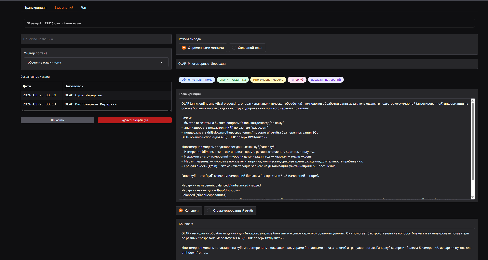

# Интеллектуальная база знаний аудиолекций

> Дипломный проект: исследование методов интеллектуальной обработки аудиолекций в условиях ограниченных вычислительных ресурсов (NVIDIA RTX 3050, 4 GB VRAM).




---

## Что это и зачем

Студент записал лекцию — теперь нужно найти конкретный момент или задать вопрос по содержимому. Вручную перематывать аудио неудобно.

Система решает это в три шага:

1. **Транскрибирует** аудио/видео в текст (GigaAM, русский язык)
2. **Суммаризирует** — строит структурированный конспект лекции (Qwen 2.5 3B)
3. **Индексирует** — позволяет искать по содержимому и задавать вопросы на естественном языке (RAG на ChromaDB)

---

## Как работает пайплайн

```
Аудио/видео файл
       │
       ▼
┌─────────────┐
│  ASR-воркер │  GigaAM распознаёт речь → текст с таймкодами
└──────┬──────┘
       │ транскрипт (JSON, ~18 чанков для часовой лекции)
       ▼
┌─────────────┐
│  LLM-воркер │  Qwen 2.5 3B строит конспект одним из трёх методов
└──────┬──────┘
       │ конспект + заголовок + список тем
       ▼
┌─────────────┐
│  RAG-движок │  Чанки транскрипта индексируются в ChromaDB
└──────┬──────┘
       │
       ▼
  База знаний — поиск, фильтрация, экспорт, вопросы в чате
```

**Воркеры запускаются как отдельные процессы** и общаются через файловую систему (`data/`). Это сделано намеренно: ASR требует GPU и специфичных зависимостей (torchcodec), LLM работает через Ollama REST API. Разделение позволяет перезапускать каждый воркер независимо — watchdog следит за их состоянием.

---

## Центральный вопрос исследования: как суммаризировать длинный текст при маленьком контексте?

Qwen 2.5 3B на 4 GB VRAM ограничен ~2048 токенами за раз. Часовая лекция — это ~10 000 слов, в одно окно не влезает. Реализованы и сравниваются три стратегии:

| Метод | Как работает | Проблема |
|-------|-------------|----------|
| **Map-Reduce** | Суммаризирует каждый чанк отдельно → сливает всё в один вызов | При большом числе чанков merge-запрос переполняет контекст |
| **Sequential** | Идёт по чанкам последовательно, накапливая резюме | Стабильный контекст, но ранние чанки теряют вес |
| **Hierarchical** | Map-Reduce в несколько уровней (группы по 3 чанка) | Больше вызовов, но контекст всегда фиксирован |

```
Map-Reduce:   [c1…c18] → суммы → один merge → итог      (ломается при N > 8)

Sequential:   c1→r1, r1+c2→r2, …, r17+c18→итог          O(N) вызовов, O(1) контекст

Hierarchical: [c1,c2,c3]→A  [c4,c5,c6]→B  …
                   [A,B]→D  …
                       D → итог                          ceil(log3 N) уровней
```

Метод выбирается в UI перед обработкой.

---

## Оценка качества

Система включает модуль бенчмаркинга (`benchmark/`) — каждый компонент оценивается независимо:

**ASR** — на датасете [Golos](https://huggingface.co/datasets/bond005/sberdevices_golos_10h_crowd):
- WER (Word Error Rate), CER (Character Error Rate), RTF (скорость относительно реального времени)

**Суммаризация** — без эталонных резюме (сравнивать не с чем):
- `faithfulness` — насколько резюме опирается на текст транскрипта (защита от галлюцинаций)
- `term_coverage` — доля ключевых терминов лекции, попавших в конспект
- `compression_ratio` — степень сжатия текста

**RAG** — синтетические QA-пары (LLM генерирует вопрос по чанку → система должна найти этот чанк):
- Precision@K, MRR

**Каскадный анализ** — как ошибки ASR (WER 0→30%) деградируют качество суммаризации.

```bash
# Полный бенчмарк → BENCHMARK_REPORT.md
python benchmark/run_all.py

# Отдельные компоненты
asr\.venv\Scripts\python benchmark/eval_asr.py
python benchmark/eval_summary.py
python benchmark/eval_rag.py
python benchmark/cascade_analysis.py
```

---

## Структура проекта

```
prototype/
├── gateway/
│   ├── app.py              # точка входа Gradio UI
│   ├── handlers.py         # загрузка файлов, поллинг результатов
│   ├── formatting.py       # рендеринг транскрипций
│   └── monitor.py          # watchdog + статус GPU/Ollama
├── asr/                    # ASR-воркер (отдельный venv — torchcodec + CUDA)
│   └── worker.py           # GigaAM, очередь задач, запись транскрипций
├── llm/                    # LLM-воркер
│   └── worker.py           # 3 метода суммаризации, заголовок, темы
├── rag/
│   └── engine.py           # ChromaDB + multilingual-e5-small + Ollama
├── storage/
│   └── kb.py               # CRUD базы знаний, экспорт в Markdown
├── shared/
│   ├── config.py           # пути и переменные окружения
│   └── log.py              # журнал активности
├── benchmark/
│   ├── metrics.py          # WER, CER, faithfulness, term_coverage, compression_ratio
│   ├── eval_asr.py         # оценка ASR на Golos
│   ├── compare_asr.py      # GigaAM vs Whisper medium/large-v3
│   ├── eval_summary.py     # оценка суммаризации
│   ├── compare_methods.py  # сравнение 3 методов суммаризации
│   ├── eval_rag.py         # оценка RAG (синтетические QA)
│   ├── cascade_analysis.py # каскадный анализ ASR→суммаризация
│   └── run_all.py          # полный бенчмарк → BENCHMARK_REPORT.md
├── install_golos.py        # загрузка тестовых данных Golos
└── data/                   # рабочие данные — не в git
```

---

## Требования

- **Python** 3.10+
- **NVIDIA GPU** с 4+ GB VRAM (тестировалось на RTX 3050), CUDA 11.8+
- **[Ollama](https://ollama.com/)** с моделью `qwen2.5:3b`
- **FFmpeg** (декодирование аудио/видео)

---

## Установка и запуск

```bash
# 1. Клонировать репозиторий
git clone https://github.com/srrymom/intelligent-knowledge-base.git
cd intelligent-knowledge-base

# 2. Основное окружение (UI, RAG, хранилище)
python -m venv gradio-env
gradio-env\Scripts\activate
pip install -r requirements.txt

# 3. ASR-воркер (отдельный venv из-за torchcodec)
cd asr && python -m venv .venv && .venv\Scripts\activate
pip install -r requirements.txt && cd ..

# 4. LLM-воркер
cd llm && python -m venv .venv && .venv\Scripts\activate
pip install -r requirements.txt && cd ..

# 5. Скачать LLM
ollama pull qwen2.5:3b

# 6. Запустить
gradio-env\Scripts\activate
python gateway/app.py
# → http://localhost:7860
```

---

## Конфигурация

| Переменная | По умолчанию | Описание |
|------------|-------------|----------|
| `OLLAMA_URL` | `http://localhost:11434` | Адрес Ollama |
| `LLM_MODEL` | `qwen2.5:3b` | Модель суммаризации |
| `LLM_NUM_CTX` | `2048` | Контекстное окно (токены) |
| `ASR_MODEL` | `v3_e2e_rnnt` | Версия GigaAM |
| `FFMPEG_PATH` | `D:\ffmpeg\bin` | Путь к FFmpeg (Windows) |
| `DATA_DIR` | `./data` | Директория рабочих данных |

---

## Планы развития

### Методы суммаризации

Текущие три метода (Map-Reduce, Sequential, Hierarchical) — базовая линия исследования. В планах реализовать ещё два метода.

---

#### Semantic Topic Aggregation *(авторский метод)*

Ключевая проблема существующих методов: чанки нарезаются механически по числу токенов, игнорируя смысловую структуру лекции. Этот метод сначала обнаруживает темы, потом суммаризирует каждую с учётом контекста соседних тем.

**Алгоритм:**

```
1. Chunking — нарезка транскрипта на чанки (по токенам)

2. Thesis per chunk — LLM извлекает одно тезисное предложение из каждого чанка

3. Embeddings — каждый тезис кодируется в вектор

4. Clustering — тезисы кластеризуются по схожести → группы = темы

5. Naming topics — LLM даёт название каждому кластеру

6. Ordering topics — темы упорядочиваются по первому вхождению в транскрипте

7. Для каждой темы:
   previous_summary = 1 предложение о предыдущей теме
   next_summary     = 1 предложение о следующей теме

   LLM генерирует раздел из:
     - оригинальных чанков темы
     - previous_summary (контекст откуда пришли)
     - next_summary (контекст куда идём)

8. Final editing — финальный проход для сглаживания переходов между разделами
```

Ключевое отличие от Hierarchical: границы между темами определяются семантически (кластеризацией эмбеддингов), а не фиксированным размером группы. Соседние темы передаются как мини-контекст — связность сохраняется без увеличения размера основного запроса.

---

#### Coarse-to-Fine суммаризация

Общая идея: сначала получить грубый черновик всей лекции, потом использовать его как ориентир для детального прохода по оригинальным чанкам.

**Алгоритм:**

```
Проход 1 — Coarse (грубый):
  Весь транскрипт → Hierarchical/Sequential → короткое резюме (~200–300 слов)
  "Лекция про байесовский вывод. Разбирается формула полной вероятности,
   пример с диагностикой заболевания, ограничения метода."

Проход 2 — Fine (детальный):
  Для каждого чанка оригинального транскрипта:
    контекст = coarse-резюме + чанк
    LLM генерирует детальный абзац с опорой на то, что уже известно о лекции в целом

Финальная сборка:
  Детальные абзацы объединяются в финальный конспект
```

Ключевое отличие от остальных методов: при генерации каждого фрагмента модель уже знает общую картину лекции. Это должно снизить «локальную близорукость» — ситуацию когда модель суммаризирует чанк без понимания его роли в целом.

Сравнение с Semantic Topic Aggregation: оба метода многопроходные, но STA сначала обнаруживает структуру через кластеризацию, а Coarse-to-Fine использует грубый текстовый конспект как направляющий контекст.

---

### Оценка
- **LLM-as-judge** — локальный Ollama оценивает суммаризацию по критериям (связность, полнота, точность). Не требует эталонов.
- **Датасет русскоязычных лекций** — сбор через yt-dlp + автосубтитры YouTube для реального корпуса.
- **compare_methods.py** — сравнение всех четырёх методов на одном корпусе.

### Модели
- **Whisper medium / large-v3** — альтернатива GigaAM; `benchmark/compare_asr.py` уже подготовлен.
- **Выбор LLM из интерфейса** — список доступных моделей из Ollama без перезапуска.

### Дистрибуция
- **Portable-пакет** — embedded Python, FFmpeg, `install.bat` / `start.bat` для установки без системных зависимостей.
- **PyWebView** — Gradio в нативном окне для десктопного UX.

---

## Стек

| Компонент | Технология |
|-----------|-----------|
| ASR | [GigaAM](https://github.com/salute-developers/GigaAM) v3_e2e_rnnt (SberDevices) |
| LLM | [Qwen 2.5 3B](https://huggingface.co/Qwen/Qwen2.5-3B) via [Ollama](https://ollama.com/) |
| Эмбеддинги | [multilingual-e5-small](https://huggingface.co/intfloat/multilingual-e5-small) |
| Векторное хранилище | [ChromaDB](https://www.trychroma.com/) |
| UI | [Gradio](https://www.gradio.app/) |
| Декодирование медиа | FFmpeg + torchcodec |
